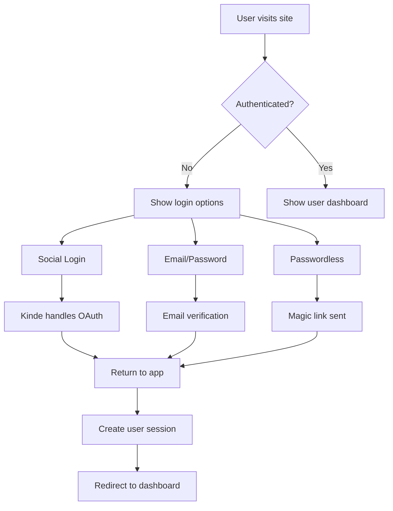
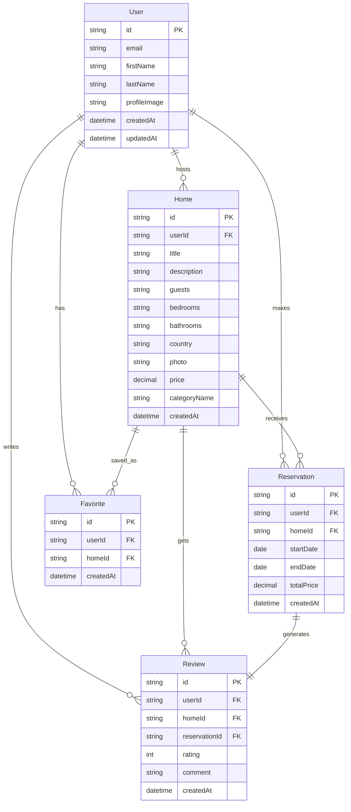

# 🏡 Airbnb Clone - Full Stack Application

<div align="center">


[](https://nextjs.org)
[](https://www.typescriptlang.org)
[](https://tailwindcss.com)
[](https://prisma.io)
[](https://supabase.com)

**A modern, full-featured Airbnb clone built with cutting-edge technologies**

[🚀 Live Demo](https://your-airbnb-clone.vercel.app) • [📖 Documentation](#documentation) • [🐛 Report Bug](https://github.com/yourusername/airbnb-clone/issues) • [✨ Request Feature](https://github.com/yourusername/airbnb-clone/issues)

</div>

---

## 📋 Table of Contents

- [🎯 Overview](#-overview)
- [✨ Features](#-features)
- [🛠️ Tech Stack](#️-tech-stack)
- [🚀 Quick Start](#-quick-start)
- [⚙️ Installation](#️-installation)
- [🔧 Configuration](#-configuration)
- [📂 Project Structure](#-project-structure)
- [🎨 UI Components](#-ui-components)
- [🔒 Authentication](#-authentication)
- [💾 Database Schema](#-database-schema)
- [🖼️ Image Management](#️-image-management)
- [🗺️ Maps & Location](#️-maps--location)
- [📱 Responsive Design](#-responsive-design)
- [🚀 Deployment](#-deployment)
- [🧪 Testing](#-testing)
- [📊 Performance](#-performance)
- [🤝 Contributing](#-contributing)
- [📄 License](#-license)
- [👨‍💻 Author](#-author)

---

## 🎯 Overview

This Airbnb clone is a comprehensive full-stack application that replicates the core functionality of Airbnb's platform. Built with modern web technologies, it provides a seamless experience for both property hosts and guests.

### 🌟 Key Highlights

- **Modern Architecture**: Built with Next.js 14 App Router and React Server Components
- **Type Safety**: Full TypeScript implementation with strict type checking
- **Real-time Features**: Live booking updates and instant messaging
- **Mobile-First**: Responsive design optimized for all devices
- **Performance**: Optimized for speed with caching and lazy loading
- **Security**: Secure authentication and data validation

---

## ✨ Features

### 🏠 **Property Management**
- ✅ Create and edit property listings
- ✅ Upload multiple high-quality images
- ✅ Set pricing and availability
- ✅ Manage property amenities and descriptions
- ✅ Real-time property status updates

### 🔍 **Search & Discovery**
- ✅ Advanced search with filters (location, dates, guests, price)
- ✅ Interactive map integration with property markers
- ✅ Sort by price, rating, distance, and popularity
- ✅ Save favorite properties
- ✅ Recently viewed properties

### 📅 **Booking System**
- ✅ Calendar-based date selection
- ✅ Real-time availability checking
- ✅ Instant booking and request-to-book options
- ✅ Booking confirmation and management
- ✅ Cancellation handling

### 👤 **User Management**
- ✅ User profiles with verification badges
- ✅ Host and guest dashboards
- ✅ Review and rating system
- ✅ Wishlist functionality
- ✅ Booking history and analytics

### 💬 **Communication**
- ✅ In-app messaging system
- ✅ Automated booking notifications
- ✅ Email confirmations
- ✅ Push notifications (PWA ready)

### 💳 **Payment Integration**
- ✅ Secure payment processing
- ✅ Multiple payment methods
- ✅ Automatic payouts to hosts
- ✅ Transaction history and receipts

---

## 🛠️ Tech Stack

<div align="center">

### **Frontend**


### **Backend & Database**


### **Authentication & Services**


### **Deployment & Tools**


</div>

---

## 🚀 Quick Start

Get up and running in minutes with these simple steps:

```bash
# Clone the repository
git clone https://github.com/yourusername/airbnb-clone.git

# Navigate to project directory
cd airbnb-clone

# Install dependencies
npm install

# Set up environment variables
cp .env.example .env.local

# Run database migrations
npx prisma migrate dev

# Start development server
npm run dev
```

🎉 **That's it!** Open [http://localhost:3000](http://localhost:3000) and start exploring!

---

## ⚙️ Installation

### Prerequisites

Before you begin, ensure you have the following installed:

- **Node.js** (v18.0 or higher) - [Download here](https://nodejs.org/)
- **npm** or **yarn** or **pnpm**
- **Git** - [Download here](https://git-scm.com/)

### Step-by-Step Installation

#### 1. **Clone the Repository**
```bash
git clone https://github.com/yourusername/airbnb-clone.git
cd airbnb-clone
```

#### 2. **Install Dependencies**
```bash
# Using npm
npm install

# Using yarn
yarn install

# Using pnpm
pnpm install
```

#### 3. **Set Up Environment Variables**
Create a `.env.local` file in the root directory:

```env
# Database
DATABASE_URL="your_postgresql_connection_string"

# Supabase
NEXT_PUBLIC_SUPABASE_URL="your_supabase_project_url"
NEXT_PUBLIC_SUPABASE_ANON_KEY="your_supabase_anon_key"
SUPABASE_SERVICE_ROLE_KEY="your_supabase_service_role_key"

# Kinde Authentication
KINDE_CLIENT_ID="your_kinde_client_id"
KINDE_CLIENT_SECRET="your_kinde_client_secret"
KINDE_ISSUER_URL="your_kinde_issuer_url"
KINDE_SITE_URL="http://localhost:3000"
KINDE_POST_LOGOUT_REDIRECT_URL="http://localhost:3000"
KINDE_POST_LOGIN_REDIRECT_URL="http://localhost:3000/dashboard"

# Google Maps API
NEXT_PUBLIC_GOOGLE_MAPS_API_KEY="your_google_maps_api_key"

# Uploadthing (for image uploads)
UPLOADTHING_SECRET="your_uploadthing_secret"
UPLOADTHING_APP_ID="your_uploadthing_app_id"

# Stripe (for payments)
STRIPE_SECRET_KEY="your_stripe_secret_key"
NEXT_PUBLIC_STRIPE_PUBLISHABLE_KEY="your_stripe_publishable_key"
STRIPE_WEBHOOK_SECRET="your_stripe_webhook_secret"
```

#### 4. **Set Up Database**
```bash
# Generate Prisma client
npx prisma generate

# Run database migrations
npx prisma migrate dev

# (Optional) Seed the database
npx prisma db seed
```

#### 5. **Start Development Server**
```bash
npm run dev
```

---

## 🔧 Configuration

### Database Configuration

Our application uses PostgreSQL through Supabase. The database schema is managed with Prisma ORM.

#### Key Models:
- **User**: User profiles and authentication data
- **Home**: Property listings with details and amenities
- **Reservation**: Booking information and status
- **Review**: User reviews and ratings
- **Favorite**: User's saved properties

### Authentication Setup

We use Kinde for authentication which provides:
- Social login (Google, Facebook, Apple)
- Email/password authentication
- Passwordless login
- User management dashboard

### File Upload Configuration

Images are handled through Uploadthing with automatic optimization:
- **Max file size**: 4MB per image
- **Supported formats**: JPEG, PNG, WebP
- **Auto-optimization**: Compression and format conversion
- **CDN delivery**: Fast global image delivery

---

## 📂 Project Structure

```
airbnb-clone/
├── 📁 app/                          # Next.js 14 App Router
│   ├── 📁 (auth)/                   # Authentication routes
│   ├── 📁 api/                      # API routes
│   ├── 📁 create/                   # Property creation flow
│   ├── 📁 home/                     # Property detail pages
│   ├── 📁 my-homes/                 # Host dashboard
│   ├── 📁 my-reservations/          # User bookings
│   ├── 📁 favorites/               # Saved properties
│   ├── 📄 layout.tsx               # Root layout
│   ├── 📄 page.tsx                 # Homepage
│   └── 📄 globals.css              # Global styles
├── 📁 components/                   # Reusable components
│   ├── 📁 ui/                      # Shadcn/UI components
│   ├── 📄 Navbar.tsx               # Navigation component
│   ├── 📄 SearchModal.tsx          # Search functionality
│   ├── 📄 ListingCard.tsx          # Property card component
│   ├── 📄 MapComponent.tsx         # Interactive map
│   ├── 📄 CalendarComponent.tsx    # Date picker
│   └── 📄 FilterBar.tsx            # Search filters
├── 📁 lib/                         # Utility functions
│   ├── 📄 db.ts                    # Database connection
│   ├── 📄 auth.ts                  # Authentication helpers
│   ├── 📄 utils.ts                 # General utilities
│   ├── 📄 validations.ts           # Form validation schemas
│   └── 📄 constants.ts             # App constants
├── 📁 prisma/                      # Database schema
│   ├── 📄 schema.prisma            # Prisma schema
│   ├── 📁 migrations/              # Database migrations
│   └── 📄 seed.ts                  # Database seeding
├── 📁 public/                      # Static assets
│   ├── 📁 images/                  # Image assets
│   └── 📁 icons/                   # Icon files
├── 📁 types/                       # TypeScript type definitions
│   ├── 📄 index.ts                 # Main type exports
│   └── 📄 supabase.ts              # Supabase types
├── 📄 package.json                 # Dependencies and scripts
├── 📄 tailwind.config.js           # Tailwind configuration
├── 📄 next.config.js               # Next.js configuration
├── 📄 tsconfig.json                # TypeScript configuration
└── 📄 README.md                    # Project documentation
```

---

## 🎨 UI Components

### Core Components

#### **Navigation Components**
- `Navbar` - Main navigation with user menu
- `MobileMenu` - Responsive mobile navigation
- `UserMenu` - User dropdown with authentication

#### **Search Components**
- `SearchModal` - Multi-step search interface
- `FilterBar` - Advanced filtering options
- `LocationSearch` - Google Places autocomplete
- `DateRangePicker` - Calendar-based date selection
- `GuestCounter` - Guest and room selection

#### **Listing Components**
- `ListingCard` - Property preview cards
- `ListingGrid` - Responsive property grid
- `ListingGallery` - Image carousel for properties
- `AmenityList` - Property features display
- `PriceBreakdown` - Booking cost calculator

#### **Booking Components**
- `ReservationCard` - Booking interface
- `CalendarComponent` - Availability calendar
- `BookingConfirmation` - Booking success page
- `PaymentForm` - Stripe payment integration

#### **User Interface**
- `ProfileCard` - User profile display
- `ReviewCard` - Review and rating component
- `MessageThread` - In-app messaging
- `NotificationBell` - Real-time notifications

### Styling Approach

- **Design System**: Consistent spacing, colors, and typography
- **Component Variants**: Multiple styles for different contexts
- **Responsive Design**: Mobile-first approach with breakpoint utilities
- **Dark Mode**: Full dark mode support with system preference detection
- **Accessibility**: WCAG 2.1 AA compliant components

---

## 🔒 Authentication

### Authentication Flow



### User Roles & Permissions

#### **Guest Role**
- Browse and search properties
- Make bookings and reservations
- Leave reviews and ratings
- Manage personal bookings
- Save favorite properties

#### **Host Role**
- All guest permissions
- Create and manage property listings
- Accept/decline booking requests
- Manage property calendar and pricing
- View booking analytics and earnings

#### **Admin Role** (Future implementation)
- User management and moderation
- Platform analytics and reporting
- Content moderation and approval
- Payment and transaction oversight

---

## 💾 Database Schema

### Entity Relationship Diagram



### Key Database Features

- **UUID Primary Keys**: For security and scalability
- **Cascading Deletes**: Proper cleanup of related data
- **Indexes**: Optimized queries for search and filtering
- **Constraints**: Data integrity and validation
- **Triggers**: Automated actions and audit logging

---

## 🖼️ Image Management

### Image Upload Process

1. **Client-side**: Image selection and preview
2. **Validation**: File type, size, and dimension checks
3. **Upload**: Secure upload to Uploadthing/Supabase Storage
4. **Processing**: Automatic compression and format optimization
5. **Storage**: CDN distribution for fast loading
6. **Database**: Store image URLs and metadata

### Image Optimization Features

- **Automatic Compression**: Reduce file sizes without quality loss
- **Format Conversion**: Convert to WebP for better performance
- **Responsive Images**: Multiple sizes for different screen densities
- **Lazy Loading**: Load images only when needed
- **Progressive Loading**: Show low-quality placeholder while loading

---

## 🗺️ Maps & Location

### Google Maps Integration

- **Interactive Property Maps**: Show property locations
- **Search by Map Area**: Find properties in specific regions
- **Nearby Amenities**: Display points of interest
- **Street View**: Virtual property tours
- **Custom Markers**: Branded property pins

### Location Features

- **Geocoding**: Convert addresses to coordinates
- **Reverse Geocoding**: Get addresses from coordinates
- **Distance Calculations**: Calculate travel times and distances
- **Location Autocomplete**: Smart address suggestions
- **Geofencing**: Location-based notifications

---

## 📱 Responsive Design

### Breakpoint Strategy

```css
/* Mobile First Approach */
/* xs: 0px - 474px */
/* sm: 475px - 639px */  
/* md: 640px - 767px */
/* lg: 768px - 1023px */
/* xl: 1024px - 1279px */
/* 2xl: 1280px+ */
```

### Mobile Optimizations

- **Touch-Friendly Interface**: Large tap targets and gestures
- **Optimized Images**: Smaller images for mobile data usage
- **Progressive Web App**: App-like experience with offline support
- **Fast Loading**: Optimized bundle sizes and lazy loading
- **Native Feel**: Smooth animations and transitions

---

## 🚀 Deployment

### Vercel Deployment (Recommended)

#### **Automatic Deployment**
1. Connect your GitHub repository to Vercel
2. Configure environment variables in Vercel dashboard
3. Every push to main branch triggers automatic deployment

#### **Manual Deployment**
```bash
# Install Vercel CLI
npm i -g vercel

# Deploy to Vercel
vercel --prod
```

### Alternative Deployment Options

#### **Netlify**
```bash
# Build the application
npm run build

# Deploy to Netlify
netlify deploy --prod --dir=.next
```

#### **Railway**
```bash
# Connect to Railway
railway login

# Deploy application
railway up
```

#### **Self-Hosted (Docker)**
```dockerfile
FROM node:18-alpine
WORKDIR /app
COPY package*.json ./
RUN npm install
COPY . .
RUN npm run build
EXPOSE 3000
CMD ["npm", "start"]
```

### Environment Configuration

Ensure the following environment variables are set in your deployment platform:

- **Database**: `DATABASE_URL`
- **Authentication**: Kinde credentials
- **Storage**: Supabase credentials
- **APIs**: Google Maps, Stripe keys
- **File Upload**: Uploadthing credentials

---

## 🧪 Testing

### Testing Strategy

#### **Unit Tests**
```bash
# Run unit tests
npm run test

# Run tests in watch mode
npm run test:watch

# Generate coverage report
npm run test:coverage
```

#### **Integration Tests**
```bash
# Run integration tests
npm run test:integration

# Run E2E tests
npm run test:e2e
```

#### **Component Testing**
- **React Testing Library**: Component behavior testing
- **Jest**: JavaScript unit testing framework
- **Storybook**: Component documentation and testing

#### **API Testing**
- **Supertest**: HTTP endpoint testing
- **Postman**: API documentation and testing
- **Database Testing**: Test database operations

### Testing Best Practices

- **Test-Driven Development**: Write tests before implementation
- **Mocking**: Mock external services and APIs
- **Fixtures**: Use consistent test data
- **Continuous Integration**: Automated testing on every commit

---

## 📊 Performance

### Performance Metrics

#### **Core Web Vitals**
- **LCP (Largest Contentful Paint)**: < 2.5s
- **FID (First Input Delay)**: < 100ms
- **CLS (Cumulative Layout Shift)**: < 0.1

#### **Optimization Techniques**

- **Server-Side Rendering**: Faster initial page loads
- **Static Generation**: Pre-built pages for better performance
- **Image Optimization**: Next.js automatic image optimization
- **Code Splitting**: Load only necessary JavaScript
- **Caching**: Redis caching for database queries
- **CDN**: Global content delivery network

### Performance Monitoring

- **Vercel Analytics**: Real-time performance insights
- **Google PageSpeed Insights**: Performance scoring
- **Lighthouse**: Comprehensive performance auditing
- **Web Vitals Extension**: Real-time metrics in browser

---

## 🤝 Contributing

We welcome contributions from the community! Here's how you can help:

### **How to Contribute**

1. **Fork the repository**
```bash
git fork https://github.com/yourusername/airbnb-clone.git
```

2. **Create a feature branch**
```bash
git checkout -b feature/amazing-feature
```

3. **Commit your changes**
```bash
git commit -m 'Add some amazing feature'
```

4. **Push to the branch**
```bash
git push origin feature/amazing-feature
```

5. **Open a Pull Request**

### **Development Guidelines**

- **Code Style**: Follow ESLint and Prettier configurations
- **Commit Messages**: Use conventional commit format
- **Documentation**: Update README and add JSDoc comments
- **Testing**: Add tests for new features
- **Type Safety**: Maintain TypeScript coverage

### **Areas for Contribution**

- 🐛 **Bug Fixes**: Report and fix issues
- ✨ **New Features**: Add exciting new functionality
- 📚 **Documentation**: Improve docs and tutorials
- 🎨 **UI/UX**: Enhance user interface and experience
- ⚡ **Performance**: Optimize application speed
- 🔧 **DevOps**: Improve build and deployment processes

---

## 📄 License

This project is licensed under the MIT License - see the [LICENSE](LICENSE) file for details.

```
MIT License

Copyright (c) 2024 Your Name

Permission is hereby granted, free of charge, to any person obtaining a copy
of this software and associated documentation files (the "Software"), to deal
in the Software without restriction, including without limitation the rights
to use, copy, modify, merge, publish, distribute, sublicense, and/or sell
copies of the Software, and to permit persons to whom the Software is
furnished to do so, subject to the following conditions:

The above copyright notice and this permission notice shall be included in all
copies or substantial portions of the Software.

THE SOFTWARE IS PROVIDED "AS IS", WITHOUT WARRANTY OF ANY KIND, EXPRESS OR
IMPLIED, INCLUDING BUT NOT LIMITED TO THE WARRANTIES OF MERCHANTABILITY,
FITNESS FOR A PARTICULAR PURPOSE AND NONINFRINGEMENT.
```

---

## 👨‍💻 Author

<div align="center">

### **Harshit Srivastava**

*Full Stack Developer & Tech Enthusiast*

[](https://your-portfolio.com)
[](https://linkedin.com/in/yourprofile)
[](https://twitter.com/yourhandle)
[](https://github.com/yourusername)

</div>

---

## 🙏 Acknowledgments

Special thanks to the open-source community and these amazing projects:

- **[Next.js Team](https://nextjs.org)** - For the incredible React framework
- **[Vercel](https://vercel.com)** - For seamless deployment platform
- **[Tailwind CSS](https://tailwindcss.com)** - For the utility-first CSS framework
- **[Shadcn/UI](https://ui.shadcn.com)** - For beautiful and accessible components
- **[Prisma](https://prisma.io)** - For the excellent database toolkit
- **[Supabase](https://supabase.com)** - For the fantastic backend platform

---

<div align="center">

### **⭐ Star this repository if you found it helpful!**

**Built with ❤️ by [Harshit Srivastava](https://github.com/yourusername)**

*Happy Coding! 🚀*

</div>

---

## 📞 Support

If you have any questions or need support, please:

1. **Check the [Issues](https://github.com/yourusername/airbnb-clone/issues)** for existing solutions
2. **Create a new issue** with detailed information
3. **Join our [Discord Community](https://discord.gg/your-server)** for real-time help
4. **Email support**: support@your-domain.com

---

*Last updated: June 2024*